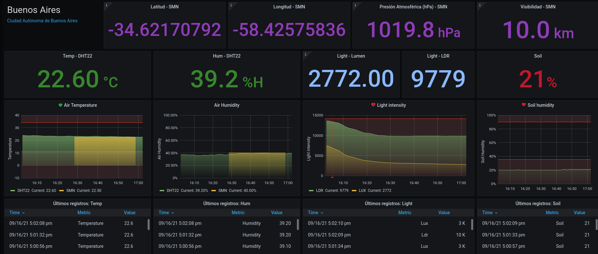

# PlantMonitor
Plant Monitoring v0.1.0

### Important
- Este proyecto está financiado 100% por mi mismo. (Por esa razón crece lentamente).
- Esta es la versión 0.1.0, por ende, algunas cosas no tienen el mejor diseño ni el código más elegante. 
- Sientete libre de forckear y mejorar. O si crees que puedes ayudarme a mejorar el código, bienvenido seas!

- Si crees que es interesante para tu jardin o invernadero por favor contactame, podemos hacer algo fantástico juntos!
- Contacto: jpradoar (arroba) gm4il . c0m

### Info
Este proyecto surge de la necesidad de monitorear el estado y ciclo de vida de una planta.
En este caso tomates cherry. La finalidad del mismo es monitorear el ciclo de vida, 
guardar los datos en una base de datos, para luego generar lo que yo llamo un "plant book", el cual
refleje los niveles necesarios para un correcto y continuo crecimiento. Junto con esto
están configurados automáticamente los niveles máximos y mínimos de alertas, que en el caso que 
los mismos estén fuera de los niveles establecidos, enviará una alerta para analizar el problema.
El sistema una simple API que puede ser consultada públicamente.

### In the future:
  - Generar un pequeño invernadero con control de ventilación.      [On going]
  - Generar el sistema de riego automático.                         [Pending...] 
  - Generar un Plant Book mas completo.                             [Pending...]
  - Implementar el uso de paneles solares (100% autosustentable).   [Pending...]
  - Implementar el uso en Hidroponia.                               [Pending...]

### Images:

   

   

   

### Circuit (Pending...)

   

   

   

   

### How to run
<pre>
git clone https://github.com/jpradoar/PlantMonitor.git
cd infra/ 
docker-compose up -d
</pre>

### FAQ
<pre>
  Que tanto va a crecer este proyecto?
    Mi idea es poder crecer hasta tener un sistema completo de monitoreo, 
    análisisis, riego automatico y generar mis propios PlantBook a travez de la experiencia.

  Tengo un pequeño jardínin, puedo implementarlo?
    Si, puedes implementarlo sin problemas. (de hecho seria genial!)

  Tengo un invernadero y quiero implementarlo. Puedo agregar mas sensores?
    Si, puedes agregar tantos sensores como la cantidad de pines (o más si usas expansor analogico!).

  Tengo algunas dudas y preguntas acerca del proyecto. ¿Como puedo contactarte?
    Puedes enviarme un mail y me pondré en contacto.  jpradoar (arroba) gm4il . c0m

  Quiero ayudar. ¿Como puedo hacerlo?
    Si sabes programar puedes revisar el codigo y mejorarlo. Así todos tendremos un mejor sistema.
    Si sabes de jardinería, puedes generar tus  PRE-PlantBooks. (lo cual ayudará a tener niveles más acertados)
    Si sabes de diseño, puedes intentar mejorar las interfaces o la arquitectura en general.
    Cualquier skill sirve. Solo sientete libre de comunicarlo.
</pre>

