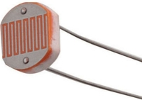

#   PlantMonitor "Real Plant Book" :chart_with_downwards_trend: :seedling:
Version v0.1-alpha

### Importante
- Este proyecto está financiado 100% por mi mísmo. (Por tal razón crece lentamente).
- Esta es la versión v0.1-alpha.  Si bien es completamente funcional, algunas partes del sistema no tienen el mejor diseño ni el código más elegante. 
- Sientete libre de "forckear" y mejorar. O si crees que puedes ayudarme a mejorar el código, bienvenido seas!

- <b>Si crees que es interesante para tu jardín, huerta o invernadero por favor contactame, seguramente podremos hacer algo fantástico juntos!</b>
- Contacto: jpradoar @ gmail . com

### Info
Este proyecto surge de la necesidad de monitorear el estado y ciclo de vida de una planta, usando tecnologías de bajo costo bajo el concepto de IoT,
En este caso, Internet en tomates cherry :tomato:. 

El sistema recolecta datos obtenidos de los sensores que son almacenados en una base de datos. Estos a su vez, son mostrados en un panel en tiempo real, para luego generar lo que yo llamo un "Real Plant Book", el cual refleje los niveles reales y necesarios, (e ideales en el mejor de los casos), para un correcto y continuo crecimiento de la planta o fruto. Junto con esto
están configurados unos niveles máximos y mínimos de alertas, (agua, sol, etc) que, en el caso de que estos estén fuera de los niveles establecidos, enviará automáticamente una alerta para analizar el problema, (mucho calor, poca agua, etc etc)

El sistema también cuenta con una simple API que puede ser consultada públicamente, para fines múltiples.

### En el futuro:
  - Documentar con mayor detalle y traducir a ingles                <b>[On going]</b>
  - Generar un pequeño invernadero con control de ventilación.      <b>[On going]</b>
  - Implementar el uso de paneles solares (100% autosustentable).   <b>[Pending...]</b>
  - Generar el sistema de riego automático.                         <b>[Pending...]</b>
  - Generar un Plant Book más completo.                             <b>[Pending...]</b>
  - Implementar el uso en Hidroponia.                               <b>[Pending...]</b>
  - Implementar desarrollo a una escala mayor.                      <b>[Pending...]</b>

 

### Panel del sistema completo de la planta (Grafana)

  

 

### Mensajes y alertas en Slack + Thresholds/Umbrales configurables

  

 

### Interfaz web del modulo de la planta

  

   

### Materiales (Pending...)

      
      

   

### Circuitos

  

   

### Imagenes Planta y prueba de concepto final

Planta de tomate cherry 
   

Mono "invernadero" (cañas de bambú y bolsa Polipropileno) 
   

Final 
   

 

### Cómo correr/ejecutar
<pre>
git clone https://github.com/jpradoar/PlantMonitor.git
cd PlantMonitor/infra/
docker-compose up -d
</pre>

 

### Preguntas frecuentes: (FAQ)
 - El proyecto es publico, ¿tiene algún costo?
    El proyecto es Open Source, es decir que todo el codigo està documentado y publicado para que cualquiera lo pueda usar, modificar y mejorar.
    100% reproducible por cualquier persona sin costo alguno. (solo deberías conseguir los materiales)
    Y lo más importante es sin fines de lucro.

 - Que tanto va a crecer este proyecto?
    Mi idea es poder crecer hasta tener un sistema completo de monitoreo, 
    análisisis, riego automatico y generar mis propios PlantBook a travez de la experiencia.

 - Tengo un pequeño jardínin, puedo implementarlo?
    Si, puedes implementarlo sin problemas. (de hecho seria genial!)

 - Tengo un invernadero y quiero implementarlo. Puedo agregar mas sensores?
    Si, puedes agregar tantos sensores como la cantidad de pines (o más si usas expansor analogico!).

 - Tengo algunas dudas y preguntas acerca del proyecto. ¿Como puedo contactarte?
    Puedes enviarme un mail y me pondré en contacto.  jpradoar (arroba) gm4il . c0m

 - Quiero ayudar. ¿Como puedo hacerlo?
    Si sabes programar puedes revisar el codigo y mejorarlo. Así todos tendremos un mejor sistema.
    Si sabes de jardinería, puedes generar tus  PRE-PlantBooks. (lo cual ayudará a tener niveles más acertados)
    Si sabes de diseño, puedes intentar mejorar las interfaces o la arquitectura en general.
    Cualquier skill sirve. Solo sientete libre de comunicarlo.
